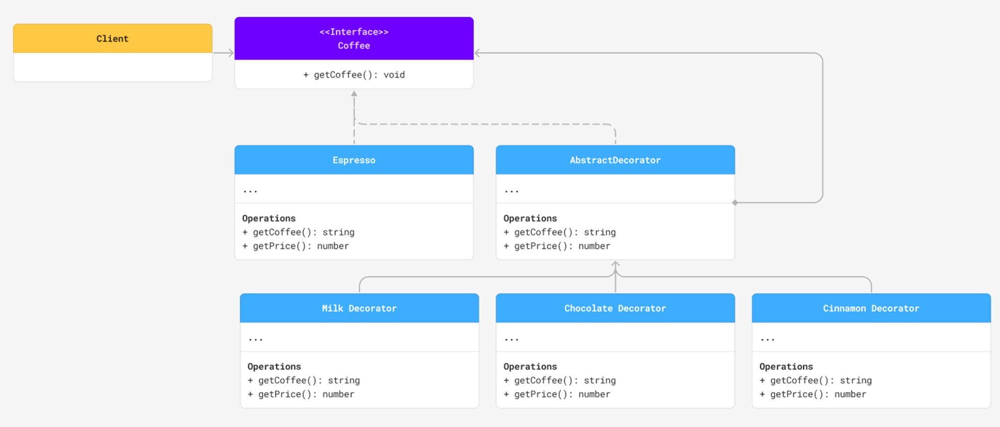
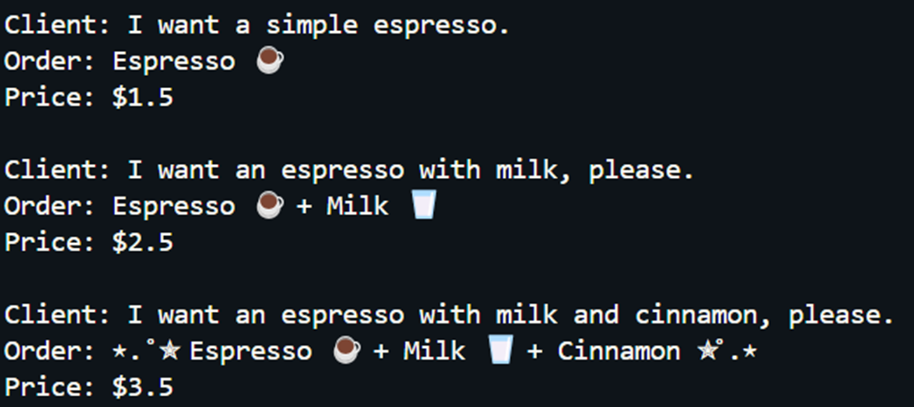
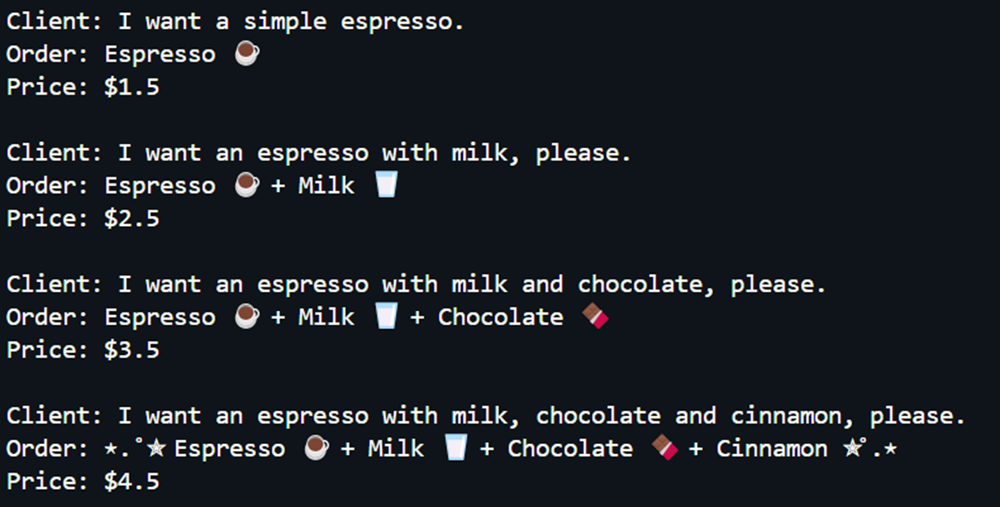

# Patrones Estructurales

English version: https://github.com/ZAnaKarenZ/structural-patterns/blob/main/README.md

Ejercicio de la clase de arquitectura de software para entender los patrones Proxy y Decorator. 

Referencia: Refactoring.Guru. (s. f.). Structural design patterns. https://refactoring.guru/design-patterns/structural-patterns

## Decorator
Permite agregar nuevos comportamientos a objetos, envolviéndolos dentro de otros objetos que contienen esos comportamientos.

Utiliza relaciones de composición en vez de herencia, lo que permite a un objeto delegar tareas en vez de realizarlas por su cuenta. Además, puede elegir delegar tareas a distintos objetos, lo que le permite tener diferentes comportamientos en tiempo de ejecución.

## Proxy
Permite tener un substituto para otro objeto, buscando controlar el acceso al objeto original. De esta manera, puedes realizar una acción antes o después de que el objeto original reciba el mensaje.

También utiliza relaciones de composición, donde el objeto Proxy crea un objeto real y le delega todas las tareas.

### ¿Cuál es la principal diferencia entre el patrón Decorator y el patrón Proxy?

Ambos patrones utilizan relaciones de composición para delegar acciones. Sin embargo, tienen funciones completamente distintas:

Proxy funciona como sustituto del objeto original. El cliente interactúa con el objeto Proxy, pero no con el real. El Proxy es quien maneja el ciclo de vida del objeto real y le envía todos las peticiones del cliente.

Decorator no sustituye un objeto, si no que busca añadir comportamientos. Se pueden añadir varios decoradores para añadir múltiples comportamientos a un objeto. Además, los decoradores son controlados directamente por el cliente.

### ¿En qué tipo de escenarios usarías cada uno?

Utilizaría Proxy para inicializar objetos en tiempo de ejecución, evitando que consuman muchos recursos. Lo utilizaría también por razones de seguridad, permitiendo acceso solamente a ciertos métodos o solamente a usuarios que tengan las credenciales correctas. Finalmente, también lo utilizaría para acceder a un objeto de manera remota. 

Algunos ejemplos más concretos, podrían ser manejar el acceso a una base de datos o a una interfaz bancaria.

Utilizaría Decorator cuando necesite añadir múltiples funcionalidades a un objeto ya existente, especialmente en casos donde pueda haber distintas combinaciones de decoradores.   

Un ejemplo concreto donde he utilizado este patrón es al momento de crear páginas web, pues puedes añadir decoradores a una página para agregar nuevas funcionalidades o variables globales.

## Decorator UML Diagram

### Decorator execution examples

